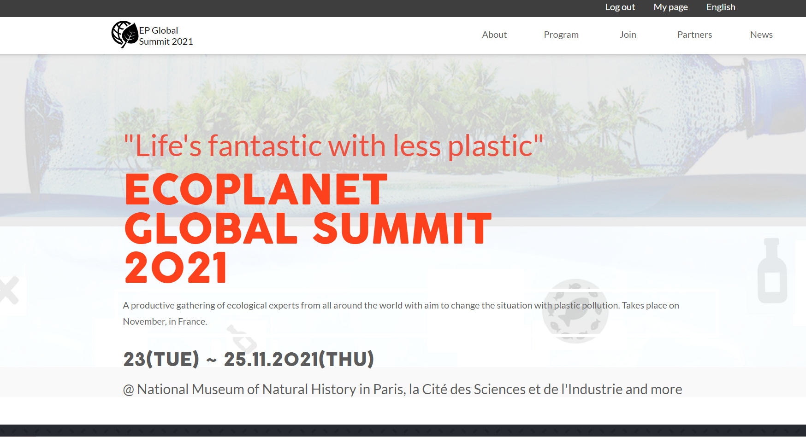

# Capstone Project! Ecological Summit

# EP Global Summit 2021

> This is a website for Ecological Summit hosted in France. The site consists of two pages: Home and About. It contains information about the place, date, event program, and other details that might interest the site's visitors. 

This site was built as the Capstone for Module 1 of the Microverse curriculum. Please, enjoy!

## Built With

- HTML/CSS
- JavaScript
- Git and GitHub

## Live Demo

[Click here to test the site yourself!](https://nataliapoletaeva.github.io/Capstone-Summit/)

## Getting Started

You can use this site both with and without installing the necessary files on your local PC. 

If you want to see how it works without any installations, visit live demo link once again!

As for the installation, follow these steps!

- Open the repository
- Download ZIP-archive to your PC
- Unpack the archive
- Open the index.html file
- Use the site!

## Author

- GitHub: [@NataliaPoletaeva](https://github.com/NataliaPoletaeva)
- Twitter: [@Fly_Meets](https://twitter.com/Fly_Meets)

## 🤝 Contributing

Contributions, issues, and feature requests are welcome!

Feel free to check the [issues page](../../issues/).

## Show your support

Give a ⭐️ if you like this project!

## Acknowledgments

The design was created by [Cindy Shin in Behance](https://www.behance.net/adagio07).

## 📝 License

This project is [MIT](./MIT.md) and [Creative Commons license of the design](https://creativecommons.org/licenses/by-nc/4.0/) licensed.
